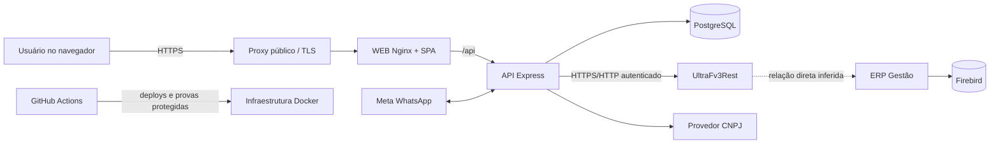
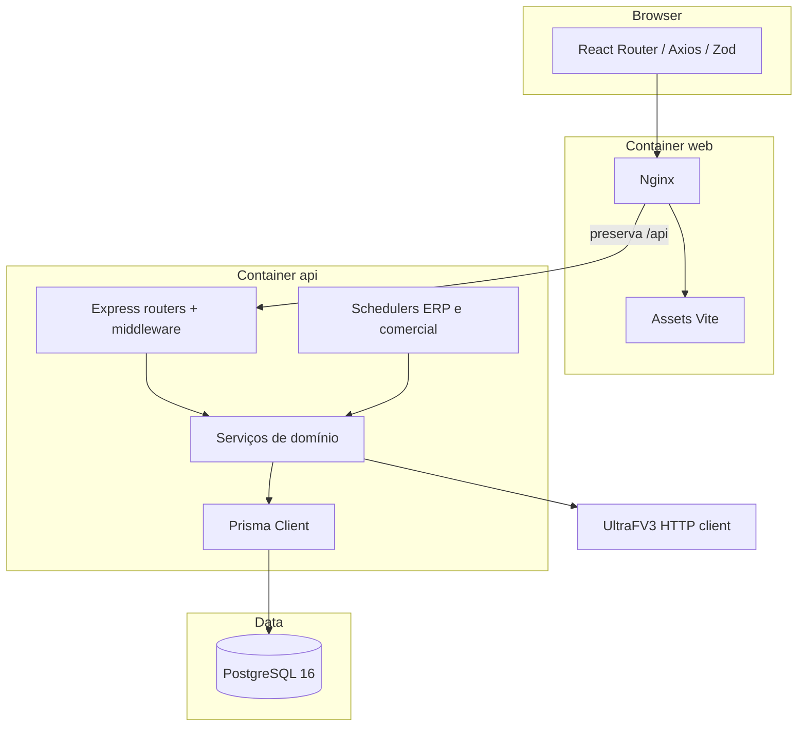

# Arquitetura do Gest-o

| Metadado | Valor |
|---|---|
| Status | **AUTORITATIVO — arquitetura técnica vigente** |
| Responsável lógico | Engenharia e Operações Gest-o |
| Revisão | 04/09/2026 — incorporado relatório estático sanitizado externo dos anexos |
| Baseline Git revisada | `58c7778bfa427ea84b52a2ff5d8230b0d60e0637` (checkout fornecido; não presumir produção atual) |
| Documentos substituídos | Nenhum; consolida e referencia documentos dispersos |
| Relacionados | [Documento Mestre](DOCUMENTO_MESTRE.md), [UltraFV3](erp-ultrafv3-integration-technical.md), [Operação](OPERACAO.md), [Deploy](DEPLOY_GUIDE.md), [ADRs](adr/README.md) |

## Como ler as evidências

Cada afirmação usa uma classe: **[CÓDIGO]**, **[CONFIG]**, **[TESTE]**, **[OPERACIONAL]**,
**[ESTÁTICA]**, **[INFERIDO]** ou **[NÃO COMPROVADO]**. Investigação histórica é evidência, não
fonte arquitetural principal. Este arquivo é a referência técnica; o Documento Mestre é o índice e a
referência executiva.

## 1. Propósito e escopo do Gest-o

**[CÓDIGO]** O Gest-o é um CRM comercial que organiza clientes, contatos, oportunidades, agenda,
atividades, metas, catálogo e pedidos ERP. **[CÓDIGO]** O ERP continua proprietário de estoque,
preço oficial, parâmetros operacionais, faturamento e financeiro; o CRM não deve substituir lógica
fiscal.

## 2. Contexto de negócio

**[CÓDIGO]** Vendedores e gestores acompanham carteira e funil, preparam oportunidades e enviam um
pedido validado ao ERP. **[NÃO COMPROVADO]** SLA, RPO, RTO, capacidade e disponibilidade contratual
não estão estabelecidos por evidência atual neste checkout.

## 3. Visão geral do sistema

**[CONFIG]** É um monorepo npm com SPA React/Vite, API Node/Express, pacote Zod compartilhado e
PostgreSQL acessado por Prisma. **[CONFIG]** API, WEB e banco são serviços Compose no ambiente
completo; o overlay produtivo referencia API/WEB e uma rede externa. Jobs residem no processo API.

## 4. Diagrama de contexto

**[CONFIG]** O proxy público e TLS aparecem em templates/workflows Nginx. **[INFERIDO]** Cloudflare
pode estar à frente porque o diagnóstico reconhece seu header, mas sua presença no tráfego corrente
não está comprovada. **[NÃO COMPROVADO]** A ligação interna exata entre `UltraFv3Rest`, ERP Gestão e
Firebird não existe no código do Gest-o. **[ESTÁTICA, relatório externo sanitizado]** O ERP contém
componentes Firebird; isso não prova que o conector acesse diretamente a mesma instância.

## 5. Diagrama de containers e componentes

## 6. Frontend

| Aspecto | Contrato |
|---|---|
| Responsabilidade | **[CÓDIGO]** SPA, navegação, formulários, dashboards e apresentação de estados. |
| Tecnologia | **[CONFIG]** React 18, Vite 5, TypeScript, React Router, Axios, Tailwind e Chart.js. |
| Entrada/saída | JSON autenticado da API → UI; ações do usuário → requests `/api`. |
| Confiança/dado | API é autoridade; local/session storage e resposta remota são não confiáveis até validação. |
| Disponibilidade/falha | Nginx expõe `/healthz`; falhas esperadas: asset/cache, proxy, timeout e contrato inválido. |
| Observabilidade/segurança | Health, erros UI e headers HTTP; não recebe segredos de integrações. |
| Estado | **Ativo**; validação de contratos é parcial e específica por funcionalidade. |

## 7. API/backend

| Aspecto | Contrato |
|---|---|
| Responsabilidade | **[CÓDIGO]** REST, domínio, RBAC, integrações, jobs e persistência. |
| Tecnologia | **[CONFIG]** Node, Express, TypeScript, Zod, Helmet, CORS e rate limits. |
| Entrada/saída | HTTP JSON/webhooks → Prisma e clientes externos → JSON/PDF/log sanitizado. |
| Dependências | PostgreSQL obrigatório; UltraFV3 e provedores são dependências degradáveis por fluxo. |
| Falhas | Banco indisponível/inconsistente bloqueia bootstrap; timeouts e 4xx/5xx são classificados. |
| Segurança | Middleware global/autenticado, validação de body, limites e sanitização; rotas legadas exigem auditoria contínua. |
| Estado | **Ativo**, monólito modular; schedulers compartilham processo e ciclo de vida. |

## 8. Banco PostgreSQL e Prisma

**[CONFIG]** Desenvolvimento/CI usam imagem PostgreSQL 16 no Compose. **[CÓDIGO]** `schema.prisma` é o
modelo versionado e Prisma Client é o acesso principal. **[CONFIG]** ambientes descartáveis usam
`DATABASE_SCHEMA_MODE=ephemeral-push`; produção exige `external`, sem DDL no bootstrap. Dados CRM
pertencem ao Gest-o; snapshots ERP persistidos continuam pertencendo ao domínio ERP e são tratados
como confidenciais. Falhas esperadas: schema divergente, indisponibilidade, volume incorreto e dados
parciais. Health, preflight e provas de schema são observabilidade operacional.

## 9. Integração ERP UltraFV3

A referência autoritativa específica é [Integração ERP UltraFV3](erp-ultrafv3-integration-technical.md).
**[CÓDIGO]** Leitura sincroniza catálogos, parceiros e snapshots financeiros; escrita envia pedidos.
A borda ERP é não confiável: payload `unknown`, rede, autenticação e temporalidade devem ser validados.
Estado **parcial**: não há DTO rigoroso para os principais payloads e contatos não são importados.

## 10. Serviço local `UltraFv3Rest`

**[CÓDIGO]** Para o Gest-o, é uma API HTTP externa autenticada e única fronteira implementada com o
ERP. **[ESTÁTICA, relatório externo sanitizado]** É um executável console Windows PE32+ x86-64 com
runtime Node.js incorporado, configuração própria de servidor/banco e launcher VBS oculto que aguarda
o processo. A análise não comprova serviço Windows, autostart, recuperação, versão, driver, protocolo
do banco nem acesso direto ao Firebird do Gestao. A finalidade das chaves AWS observadas também não
foi comprovada. Esta tarefa não abriu ou executou anexos.

## 11. Autenticação e autorização

**[CÓDIGO]** Login emite JWT de acesso/refresh; rotas protegidas aceitam Bearer e `authorize` aplica
RBAC `diretor`, `gerente` e `vendedor`. Senhas são hashes; refresh e login têm rate limits. Cookies e
headers cruzam uma fronteira não confiável. **[TESTE]** a suíte de segurança cobre equivalência de
erros, negação sem token e ausência de diagnóstico administrativo. **[LIMITAÇÃO]** tenancy não é
autoridade de autorização produtiva.

## 12. Scheduler e sincronização automática

**[CÓDIGO]** `startErpSyncScheduler` inicia depois que o listener da API sobe; configuração define
intervalos de produtos/parceiros, status de pedidos e health. Locks/runs Prisma evitam concorrência e
registram resultado. Rotas administrativas também acionam sync manual. Retry é limitado a leituras
idempotentes; pedido não recebe retry cego após resultado ambíguo. **[OPERACIONAL]** uma sync atual só
é provada por `ErpSyncRun` automático bem-sucedido e lock liberado, nunca por processo healthy.
Estado atual deve ser consultado; não é inferido deste SHA.

## 13. Pedidos ERP

**[CÓDIGO]** oportunidade ganha + cliente/vendedor/operador/itens válidos → payload sanitizável →
`POST /orders` → `ErpOrderSync` → consulta `/orderStatus`. `PEDIDO_ID_IMPORTACAO` suporta correlação;
resolução/reenvio ambíguo é explícito e append-only. O ERP é proprietário do número e status finais.
Timeout após envio pode ser ambíguo e não autoriza repetição automática.

## 14. Saúde da Plataforma e observabilidade

**[CÓDIGO]** `/api/platform-health` exige autenticação e RBAC administrativo, agrega Prisma, scheduler,
lock e reachability e diferencia zero de `null`. Logs estruturados e correlation IDs cobrem fluxos,
mas não há prova neste checkout de tracing distribuído, retenção central ou alertas 24x7. Estado
**ativo/parcial**. A referência é [Saúde da Plataforma](platform-health-erp-observability.md).

## 15. Infraestrutura e proxy

**[CONFIG]** Nginx do WEB serve assets/SPA e encaminha `/api` preservando o prefixo. Compose define
healthchecks e redes. Templates versionados cobrem proxy preview; scripts/workflows cobrem o host
produtivo. **[INFERIDO]** Cloudflare é compatível com o diagnóstico, não obrigatório nem comprovado
como hop atual. Firewall, DNS e TLS efetivos só podem ser provados operacionalmente.

## 16. Ambientes

| Ambiente | Contrato e situação |
|---|---|
| Desenvolvimento | **[CONFIG]** Vite `:5173` faz proxy `/api` para Express `:4000`; PostgreSQL local/Compose; dados locais. |
| CI | **[CONFIG]** GitHub Actions executa typecheck, smokes, Compose e PostgreSQL 16 descartável. |
| Preview | **[CONFIG]** por PR, projeto/rede/volume/banco isolados, seed sintético e proxy Nginx; destruível. |
| Produção | **[CONFIG]** workflow manual, env protegido externo ao Git, schema `external`, tenancy `disabled`; estado real requer prova operacional por SHA. |

## 17. Deploy e rollback

**[CONFIG]** Deploy Production é `workflow_dispatch` em fases build e cutover, com environments,
backup, SHA/imagens e health como gates. Merge não implanta. Rollback versionado restaura API/WEB e
preserva banco; uma migration expand compatível não é removida automaticamente. O procedimento
exato está no [Deploy Guide](DEPLOY_GUIDE.md), não deve ser duplicado aqui.

## 18. Backup e recuperação

**[CONFIG]** preparação de backup é workflow separado, publica bundle protegido e checksum; restore é
prova PostgreSQL descartável ou ação de incidente autorizada. Recovery ERP é excepcional e não é
deploy nem ferramenta diagnóstica. Backup, Recovery e restore jamais são executados por tentativa.
RPO/RTO e cópia off-site permanecem **não comprovados**.

## 19. Tenancy atual e limitações

**[CONFIG/CÓDIGO]** Produção declara `TENANCY_MODE=disabled`. Há control plane, campos nullable,
adapters e provas de expansão, mas eles não constituem isolamento completo do runtime ou RLS.
Estado **planejado/parcial**, não comercializável como multiempresa isolada. Fonte:
[TENANCY_ASSESSMENT](TENANCY_ASSESSMENT.md) e [ADR 003](adr/003-shared-schema-tenant-boundary.md).

## 20. Segurança e gestão de segredos

Segredos pertencem a arquivos/environments protegidos fora do Git. API é a única consumidora de
credenciais ERP, JWT e provedores; navegador nunca recebe essas chaves. Diagnósticos publicam
presença/classe, não valor. Dependências externas, webhooks, payloads e anexos são não confiáveis.
Nunca executar ou versionar pacotes ERP, configs, dumps, logs ou binários.

## 21. Dados sensíveis e PII

Clientes, contatos, documentos, telefones, e-mails, endereços, payloads ERP, mensagens e pedidos são
PII/dados empresariais. Logs devem usar contagem, classe, código controlado e correlação não
reversível; payload bruto não é observabilidade aceitável. Snapshots integrais em JSON/AppConfig e
`ErpOrderSync` exigem controle de acesso e política de retenção ainda parcial.

## 22. Testes e gates de qualidade

**[CONFIG]** Gates incluem typecheck/build, autenticação, UltraFV3, Saúde da Plataforma, segurança de
deploy e harnesses PostgreSQL 16. CI/preview usam dados sintéticos. Nenhum teste deve chamar ERP ou
produção. O gate documental `test:architecture-docs` verifica autoridade, links e artefatos proibidos
sem comparar o texto integral.

## 23. Limitações conhecidas

- contrato UltraFV3 tolerante/sem DTO rigoroso e temporalidade por campo;
- contato cadastral do parceiro não instrumentado;
- financeiro em JSON opaco e sem frescor exibido por campo;
- scheduler no processo API, sem worker independente;
- multi-tenancy produtiva desabilitada;
- Cloudflare, relação direta conector→Firebird, SLA, RPO/RTO e estado produtivo atual não comprovados.

## 24. Dívidas técnicas

Prioridades: contrato versionado UltraFV3; proveniência/precedência de contatos; timestamps de
snapshot financeiro; redução de JSON opaco; retenção de payloads; separar jobs se escala exigir;
concluir fronteira tenant antes de habilitá-la; reconciliar o README legado com os runbooks seguros.

## 25. Decisões arquiteturais vigentes

- [ADR 001](adr/001-ultrafv3-partner-establishment-identity.md): identidade de estabelecimento ERP.
- [ADR 002](adr/002-runtime-migration-authority-separation.md): runtime não é autoridade de DDL.
- [ADR 003](adr/003-shared-schema-tenant-boundary.md): direção de tenancy, ainda não ativada.
- `DOCUMENTO_MESTRE.md`: autoridade executiva/operacional; este arquivo: autoridade técnica.

## 26. Integrações comprovadas

| Integração | Origem → destino / direção | Protocolo e auth | Dados, frequência e acionamento | Idempotência/persistência | Observabilidade, falha/retry e segurança | Estado / referência |
|---|---|---|---|---|---|---|
| UltraFV3 leitura | ERP via conector → Gest-o | HTTP JSON; login/token global ou por vendedor | catálogos, parceiros, finanças; scheduler e manual | upsert/chaves ERP; Client/Product/AppConfig/runs | timeout, lock, runs; retry limitado a GET; segredo só API | **Parcial** / [UltraFV3](erp-ultrafv3-integration-technical.md) |
| Pedido UltraFV3 | Gest-o → ERP | HTTP JSON autenticado | pedido por ação explícita; status por sync | UUID/importação e `ErpOrderSync`; não retry cego | correlation, estado ambíguo e resolução controlada | **Ativo** / [fluxo ERP](erp-operational-flow.md) |
| Consulta CNPJ | Gest-o API → provedor configurado | HTTPS; chave opcional só backend | cadastro sob demanda | sem autoridade CRM até confirmação; cache não comprovado | timeout 3 s, erros classificados; sem chave no browser | **Ativo/configurável** / [runbook](ops/cnpj-lookup.md) |
| Meta WhatsApp | Meta ↔ Gest-o API | webhook assinado + token | eventos/mensagens quando gates habilitados | inbox/conversas; deduplicação do webhook | assinatura, rate limit e status administrativo | **Parcial/gated** / [arquitetura](communications/secure-omnichannel-foundation.md) |
| IA/Ollama | Gest-o API → provedor configurado | HTTP; chave conforme provedor | geração sob demanda com fallback | caches em memória; resultado de domínio controlado | timeout/fallback, logs sanitizados | **Opcional/parcial** / investigação relacionada |
| GitHub Actions/VPS | GitHub → host de execução | Actions + SSH/environments protegidos | CI, preview, build/cutover, backup | artefatos por SHA e bundles protegidos | gates fail-closed, aprovação, rollback | **Ativo por configuração** / [Deploy](DEPLOY_GUIDE.md) |

## 27. Documentos relacionados e manutenção

O inventário encontrou documentos especializados em `docs/adr`, `docs/communications`,
`docs/investigations`, `docs/operations`, `docs/ops`, `docs/post-deploy`, `docs/security`,
`docs/sprints` e `docs/tenancy`. Eles permanecem evidência, decisão ou runbook especializado e devem
apontar para esta visão quando descreverem arquitetura geral. `docs/architecture/README.md` é apenas
o índice do domínio arquitetural.

**Relatório externo sanitizado:** quatro pacotes foram inventariados fora desta tarefa: runtime local
UltraFV3 com configuração/logs; releases/layouts/menus/schemas fiscais do Gestao; consultas/relatórios
por nome; e binário proprietário Gestao. O inventário comprova módulos funcionais de parceiros,
vendas, pedidos, produtos, estoque e financeiro e componentes Firebird no ERP, mas não tabela, coluna,
SQL, payload HTTP, DTO ou regra financeira. A pasta `Schemas` contém documentos fiscais/eletrônicos,
não DDL relacional. Os artefatos brutos não são fonte documental e nunca devem ser versionados.

**Regra permanente:** toda alteração que modifique componentes, integrações, contratos, persistência,
autenticação, infraestrutura, deploy, observabilidade ou fluxos críticos deve atualizar, na mesma PR,
o documento arquitetural autoritativo e o Documento Mestre quando houver impacto executivo ou
operacional.

## Pedidos: projeção, identidade e call graph

`OpportunitiesPage` confirma o ganho e chama o endpoint existente da oportunidade; `crudRoutes` carrega oportunidade/cliente/vendedor/itens; `erpOrderService.createErpOrderFromOpportunity` adquire advisory lock, bloqueia envio duplicado, cria `ErpOrderSync` pendente e chama `POST /orders`. A aba `OrdersPage` lê exclusivamente `GET /orders` e `GET /orders/:id`, que projetam o mesmo registro, sem endpoint de criação concorrente. `ErpOrderStatusHistory` registra transições append-only. O escopo é obtido da associação ativa do usuário e validado através de `Opportunity -> Client.tenantId`; parâmetros do navegador nunca definem tenant e `sellerId` é ignorado para vendedores.

### Complemento de evidência: solicitações e NF-e (2026-09-04)

A “Legenda Solicitações” do ERP desktop é separada dos status comercial, operacional e de sincronização: branco/nenhuma solicitação ou restrição; amarelo/parcialmente autorizadas; vermelho/nenhuma autorizada; verde/todas autorizadas. A regra de cores do aplicativo móvel não foi comprovada como equivalente. O Gest-o mantém `requestAuthorizationStatus` independente e inicia em `UNKNOWN` enquanto não houver campo contratual. Embora uma NF seja visualmente observável na lista móvel, `POST /orders` e `GET /orderStatus` não comprovam número de NF, rota, chave ou cardinalidade; por isso NF-e permanece não instrumentada, sem inferência por finalização ou quantidade faturada.
