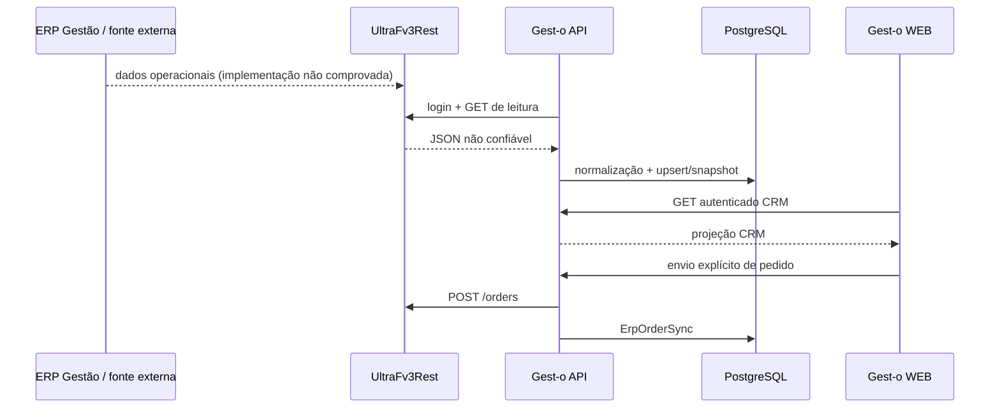

# Integração ERP UltraFV3 — contrato técnico sanitizado

| Metadado | Valor |
|---|---|
| Status | **AUTORITATIVO — integração UltraFV3** |
| Responsável lógico | Engenharia de Integração Gest-o |
| Revisão | 04/09/2026 — incorporado relatório estático sanitizado externo |
| Baseline Git revisada | `58c7778bfa427ea84b52a2ff5d8230b0d60e0637` (checkout; não prova produção) |
| Documentos substituídos | Substitui este mesmo documento na revisão anterior; mapas/investigações continuam históricos |
| Relacionados | [Arquitetura](ARQUITETURA.md), [Documento Mestre](DOCUMENTO_MESTRE.md), [auditoria de contrato](investigations/ultrafv3-client-financial-contact-mapping-2026-09.md), [fluxo de pedidos](erp-operational-flow.md) |

## Evidência e fronteiras

Rótulos: **[CÓDIGO]**, **[CONFIG]**, **[TESTE]**, **[OPERACIONAL]**, **[ESTÁTICA]**, **[INFERIDO]** e
**[NÃO COMPROVADO]**. Este documento combina o contrato visível no repositório com um relatório
estático sanitizado produzido em ambiente separado. Esta tarefa não abriu, inspecionou ou executou os anexos.

## Papéis dos sistemas

- **Gest-o:** **[CÓDIGO]** proprietário de relacionamento, carteira, funil, agenda e trilha do envio.
- **ERP Gestão/FV3:** **[CÓDIGO]** autoridade externa para cadastro operacional, produto, estoque,
  preço, financeiro, número/status e processamento do pedido.
- **UltraFv3Rest:** **[CÓDIGO]** API HTTP externa consumida pelo Gest-o; autentica, expõe leituras e
  recebe pedidos. **[ESTÁTICA, relatório externo]** é um executável Windows x64 com Node.js
  incorporado; **[NÃO COMPROVADO]** vínculo direto com Firebird.
- **Firebird:** **[ESTÁTICA, relatório externo]** componentes Firebird estão presentes no ERP Gestao;
  o Gest-o não tem driver/conexão Firebird e o acesso do conector à mesma instância é **inferido,
  não comprovado**.



## Tecnologia, inicialização e configuração do conector

**[ESTÁTICA, relatório externo sanitizado]** `UltraFv3Rest` foi identificado como console PE32+ x86-64
com runtime Node.js incorporado. Um launcher VBS cria shell, inicia o executável oculto e aguarda sua
conclusão; isso não prova serviço Windows, autostart ou recovery. Foram observados somente caminhos de
chaves de configuração para servidor e banco, nunca valores. Driver, protocolo, banco intermediário e
relação direta com Firebird não foram comprovados. Nomes de variáveis AWS existem, mas sua finalidade
funcional é desconhecida. Nenhuma versão exata foi determinada.

## Transporte e autenticação

**[CÓDIGO]** `ultraFv3Client` usa `fetch`, timeout, `POST /auth/login`, token somente em memória,
expiração quando disponível e um retry autenticado após 401. Há credencial global e credencial ERP
criptografada por vendedor. URL e credenciais vêm apenas do backend/env protegido. Respostas são
`unknown`; nenhuma resposta externa é confiável antes de normalização. Read-only GET pode receber
retry limitado; criação de pedido não recebe retry cego em resultado ambíguo.

## Rotas: chamada do Gest-o versus exposição observada

| Rota | Uso no código Gest-o | Token observado no conector | Classificação |
|---|---|---|---|
| `/auth/login` | autenticação | sim | nome comprovado; método/payload não provados pelo token |
| `/partners` | parceiros/clientes | sim | nome comprovado; schema/paginação não provados |
| `/products` | produto/estoque/preço | sim | nome comprovado; schema não provado |
| `/salesmen` | vendedor/operador/preflight | sim | nome comprovado; schema não provado |
| `/prices`, `/priceVariations` | preços | sim | nomes comprovados; schema não provado |
| `/payment-methods`, `/receiving-conditions`, `/price-tables` | referências | sim | nomes kebab-case comprovados |
| `/paymentMethods`, `/receivingConditions`, `/priceTables` | aliases tentados | sim | significado alias/etapa/rota não provado |
| `/branches`, `/operations` | referências | sim | nomes comprovados |
| `/financialProfiles` | perfil opaco | não | Gest-o tenta chamar; exposição/contrato do conector não provados |
| `/partnerTitles` | títulos opacos | não | Gest-o tenta chamar; rota financeira do conector não provada |
| `/orders`, `/orderStatus` | pedido/status | não | chamadas no Gest-o; exposição não provada pelo relatório |

Tokens não comprovam método, autenticação, query, paginação, resposta, estabilidade ou semântica.
Frequência na amostra não é métrica nem SLA. Não há endpoint de contatos comprovado.

## DTOs, extração e normalização

**[CÓDIGO]** A borda principal não possui DTO/Zod estrito: recebe `unknown`, `toArray` procura wrappers
e os mapeadores selecionam aliases. Parceiro normaliza código, razão/fantasia, documento, cidade, UF,
região, endereço e vendedor. Matching segue código, documento completo e fallback textual protegido
pela [ADR 001](adr/001-ultrafv3-partner-establishment-identity.md). Payload inesperado/vazio falha; uma
linha parcial pode usar placeholders. Essa tolerância é dívida, não contrato do fornecedor.

## Persistência e propriedade do dado

| Domínio | Destino | Política comprovada |
|---|---|---|
| parceiro | `Client` | create/update/merge por identidade; ERP atualiza campos mapeados |
| contatos | `Contact` | **não importado**; apenas CRUD CRM e movimentação em merge |
| produto/estoque | `Product` | upsert por código+classe; estoque pode ser `null` |
| preços | `ProductPrice`/caches | aliases e referências ERP |
| financeiro | `Client.financialProfile`, `partnerTitles`, totais | JSON opaco + projeções parciais |
| respostas de referência | `AppConfig` | cache JSON confidencial e timestamp de recepção |
| execução | `ErpSyncRun`, `ErpSyncLock` | resultado, trigger, exclusão mútua e rastreabilidade |
| pedido | `ErpOrderSync` | payload/resposta/status e resolução append-only |

Ausência não deve ser convertida em zero. O código financeiro ainda possui fallbacks zero e não
marca ausência/remoção de parceiro sem contrato de snapshot completo.

## Sincronização automática e manual

**[CÓDIGO]** O scheduler inicia dentro da API e coordena produtos, parceiros, referências, perfil,
títulos e status. Intervalos são configuráveis e locks separam escopos. Rotas administrativas
permitem disparo manual com RBAC. **[OPERACIONAL]** saúde do processo não prova sync: exigir pai
`scope=automatic`, `trigger=scheduler`, `success` e lock liberado. Não disparar sync para diagnóstico.

## Produtos, estoque, preços e condições

**[CÓDIGO]** `/products` fornece código, classe, unidade, descrição, status, estoque e possíveis
preços por aliases. Preços separados, variações, tabelas, métodos, condições, filiais e operações são
sincronizados/cacheados. O ERP continua autoridade; preço ausente não deve ser inventado. A exatidão
do dicionário de campos do fornecedor permanece **não comprovada** sem schema sanitizado.

## Parceiros, vendedores e contatos

**[CÓDIGO]** parceiros viram `Client` e vendedor é resolvido por código; o fluxo global possui fallback
para vendedor ativo, que deve ser monitorado. **[CÓDIGO]** telefone/e-mail não são mapeados e nenhum
`Contact` é criado. **[INTERFACE/BANCO INFORMADOS]** há telefone cadastral no ERP e tabela Contact
vazia. Presença, alias, remoção e coleção no payload são **não comprovados**. Não misturar telefone
geral da empresa com pessoa de contato e não sobrescrever edição manual.

## Perfil financeiro e títulos

**[CÓDIGO Gest-o]** `/financialProfiles` é chamado e projeta última fatura/valor quando presentes;
`/partnerTitles` é chamado, agrupa por parceiro e calcula totais. **[ESTÁTICA]** nenhum desses nomes foi
observado nos tokens sanitizados do conector; rota e payload financeiro permanecem não comprovados.
No código, saldo positivo soma aberto e due date anterior ao relógio soma vencido. Status,
baixa, tolerância, renegociação, cancelamento, timezone, atraso médio, maior atraso, cheques e cores
não têm contrato validado. Tablet manual e CRM automático só são comparáveis com timestamps iguais.
Conclusão atual: `FINANCIAL_DIVERGENCE=INSUFFICIENT_EVIDENCE`; nenhuma correção financeira autorizada.

## Pedidos

**[CÓDIGO]** oportunidade deve estar ganha e possuir cliente, vendedor/operador e itens ERP válidos. A
API monta identificador de importação, número, datas e itens, chama `/orders` com credencial do
vendedor e persiste `ErpOrderSync`. `/orderStatus` atualiza o estado. Timeout após a chamada pode ser
ambíguo; resolução e eventual supersessão exigem ato humano auditado. Nunca criar pedido para smoke.

## Falhas, observabilidade e segurança

Falhas esperadas: configuração ausente, login/401, timeout, conexão, 404 de variante, 5xx, JSON
malformado, lote vazio/parcial, lock e pedido ambíguo. Logs devem conter somente endpoint/classe,
correlação, duração, contagens e campos sanitizados. Nunca corpo bruto, token, URL privada, credencial,
PII ou dado empresarial. A Saúde da Plataforma projeta scheduler, runs, lock e reachability para RBAC
administrativo.

## Testes e diagnóstico seguro

Testes usam mocks/dados sintéticos e não chamam o ERP: sanitização, identidade, sync CRM, scheduler,
payload/número/protocolo de pedido, Saúde e autenticação. Diagnóstico permitido: endpoints CRM GET
autenticados e probe GET-only bounded, sem persistir corpo. Para fechar contatos/financeiro, coletar
somente nomes/tipos/cardinalidades/enums e timestamps sanitizados pelo canal aprovado.

## Proibições operacionais

Não executar binários/scripts/macros/DLLs anexos; não conectar Firebird; não usar credenciais de
pacote; não versionar ZIP, EXE, VBS, DLL, FDB, FBK, CRM, REM, XML empresarial, layout proprietário,
log, dump, configuração ou relatório bruto. Não executar sync, Recovery, pedido, migration, reparo ou
redistribuição para produzir evidência.

## Limitações e próximos contratos necessários

- schema sanitizado e versionado das respostas UltraFV3;
- origem/tipo/chave/precedência e remoção explícita de contato ERP;
- timestamp e completude por snapshot;
- enum/status/timezone de títulos e definição de risco/atraso;
- política de retenção de JSON e payloads;
- prova externa da relação `UltraFv3Rest` ↔ ERP/Firebird.


## Classificações permanentes do relatório externo

```text
ULTRAFV3_PACKAGE_CLASS=LOCAL_REST_CONNECTOR_RUNTIME_WITH_CONFIGURATION_AND_LOGS
GESTAO_DOCUMENTATION_PACKAGE=ERP_RELEASE_LAYOUT_MENU_AND_FISCAL_SCHEMA_ARTIFACTS
GESTAO_QUERY_PACKAGE=FUNCTIONAL_QUERY_AND_REPORT_ARTIFACT_INVENTORY
GESTAO_EXECUTABLE_PACKAGE=PROPRIETARY_WINDOWS_APPLICATION_BINARY
CONNECTOR_TECHNOLOGY=WINDOWS_X64_WITH_EMBEDDED_NODEJS_RUNTIME
CONNECTOR_CONFIGURATION=DATABASE_AND_SERVER_KEYS_PROVEN_VALUES_NOT_READ
AWS_CONFIGURATION=PRESENT_BUT_PURPOSE_NOT_PROVEN
GESTAO_DATABASE_TECHNOLOGY=FIREBIRD_COMPONENTS_PROVEN
ULTRAFV3REST_TO_GESTAO_FIREBIRD_RELATIONSHIP=INFERRED_NOT_PROVEN
GESTAO_SCHEMAS_DIRECTORY=FISCAL_AND_ELECTRONIC_DOCUMENT_SCHEMAS_NOT_DATABASE_DDL
RAW_ERP_ARTIFACTS_MUST_NOT_BE_COMMITTED
STATIC_FINDINGS_MUST_BE_SANITIZED
CONFIGURATION_VALUES_MUST_NOT_BE_DOCUMENTED
LOG_PAYLOADS_MUST_NOT_BE_REPRODUCED
```

## Projeção de pedidos no CRM (2026-09-04)

O contrato comprovado é `POST /orders` e `GET /orderStatus`. `PEDIDO_ID_IMPORTACAO` é a chave idempotente, `PEDIDO_ID` é armazenado separadamente em `erpOrderId` e `NUM_PEDIDO` em `erpOrderNumber`. A resposta parcial é tolerada: quantidades ausentes são apresentadas como zero e o texto operacional desconhecido é preservado em `operationalStatusRaw`, sem promovê-lo a enum interno. Não há contrato comprovado para ligar `NUM_NOTA`, `NOTA_ID` ou `CHNFE` ao pedido; a API retorna NFe como não instrumentada.


### Complemento de evidência: solicitações e NF-e (2026-09-04)

A “Legenda Solicitações” do ERP desktop é separada dos status comercial, operacional e de sincronização: branco/nenhuma solicitação ou restrição; amarelo/parcialmente autorizadas; vermelho/nenhuma autorizada; verde/todas autorizadas. A regra de cores do aplicativo móvel não foi comprovada como equivalente. O Gest-o mantém `requestAuthorizationStatus` independente e inicia em `UNKNOWN` enquanto não houver campo contratual. Embora uma NF seja visualmente observável na lista móvel, `POST /orders` e `GET /orderStatus` não comprovam número de NF, rota, chave ou cardinalidade; por isso NF-e permanece não instrumentada, sem inferência por finalização ou quantidade faturada.
