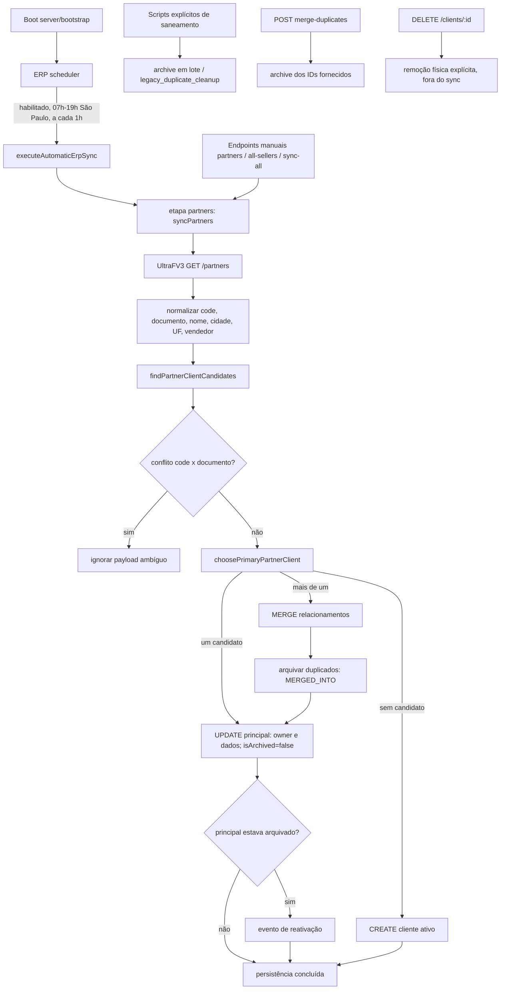

# ERP 5050 — análise de causa raiz dos 1.298 clientes arquivados

**Data da análise:** 2026-07-25  
**Escopo:** código e histórico Git disponíveis neste repositório; nenhuma leitura ou escrita em produção  
**Regra operacional:** investigação exclusivamente read-only; a Etapa 1 não foi reexecutada

## 1. Resumo executivo e veredito

O número **1.298** e a condição **zero ativos** são premissas do incidente, não fatos reproduzíveis a partir do repositório. Não há snapshot, export sanitizado, `ErpSyncRun`, log de aplicação, timeline dos clientes ou resultado da auditoria de produção versionado que demonstre quais 1.298 linhas mudaram, em que instante, por qual processo e com qual `archiveReason`. Portanto, sob o critério de encerramento solicitado, **causa raiz ainda não comprovada**.

O código atual só grava `Client.isArchived=true` em quatro operações de produção:

1. merge automático de duplicados durante o sync UltraFV3;
2. merge manual pelo endpoint de diagnóstico;
3. saneamento executado explicitamente por `erp:fix-duplicates`;
4. correção explícita de flags por `erp:fix-archived-flag`.

O scheduler **não possui reconciliação negativa**: a ausência de um parceiro na resposta `/partners` não arquiva nada. Troca de carteira também não arquiva: o cliente principal encontrado recebe o novo `ownerSellerId` e `isArchived=false`. Logo, a resposta à pergunta “uma troca de carteira pode ter arquivado 1.298 clientes?” é **NÃO pelo fluxo atual** e **NÃO COMPROVADO para o incidente histórico**. Uma troca pode fazer a carteira antiga exibir zero ativos por mudança de dono, mas não explica 1.298 flags `true`.

### Hipótese mais provável (ainda não provada)

Os registros foram marcados por uma **execução operacional dos saneamentos legados de 16/06/2026**, sobretudo `erp:fix-archived-flag` se os 1.298 nomes já tinham o prefixo `[ARQUIVADO ERP DUP]`, ou por `erp:fix-duplicates` se foram agrupados por código/documento/identidade. É a única família de fluxo capaz de fazer `updateMany` e de atravessar toda a base candidata em uma execução. O merge normal do sync e o endpoint manual arquivam somente IDs duplicados encontrados/fornecidos e não têm regra por `ownerSeller.erpCode`.

Contudo, até essa hipótese exige dados ausentes: distribuição dos 1.298 por `archiveReason`, prefixo, `updatedAt`, código neutralizado e eventos de timeline. Sem eles não se pode distinguir saneamento, merge automático, merge manual, import/SQL externo ou uma versão não contida no Git.

## 2. Desambiguação indispensável de “ERP_CODE=5050”

Há duas identidades distintas:

| Campo | Entidade | Uso |
|---|---|---|
| `User.erpCode` | vendedor | relaciona código de vendedor do payload à carteira; o fluxo por usuário registra `sellerErpCode` |
| `Client.code` | cliente/parceiro | chave prioritária de matching do parceiro |

O teste usa deliberadamente `Client.code="5050"` para uma troca de vendedor; isso não demonstra que `5050` seja o código do vendedor do incidente. Nenhum ponto de arquivamento filtra por `User.erpCode`, `ownerSellerId` ou “todos da carteira”. A evidência de produção precisa declarar se “ERP_CODE=5050” significa o código do vendedor ou o código de parceiro.

## 3. Inventário completo de quem grava `archived`

### 3.1 Merge automático UltraFV3

| Item | Evidência |
|---|---|
| Arquivo/função | `apps/api/src/services/ultraFv3SyncService.ts`, `mergeDuplicateClientsIntoPrimary()` |
| Chamada | `persistPartnerPayload()` chama o merge dentro de transação quando `candidates.length > 1` e não há conflito forte |
| Quem chama | `persistPartnerRowsForSeller()` / persistência global → `syncPartnersByUser()` ou `syncPartners()` |
| Quando | endpoints manuais de parceiros/full-sync e etapa `partners` do scheduler |
| Regra | candidatos são união de mesmo `Client.code`, mesmo documento, ou — apenas sem match forte — mesmo nome+cidade+UF; primário prefere ativo, histórico, vendedor recebido, atualização ERP e criação antiga |
| Efeito | move seis classes de relacionamento, neutraliza código/documento/nome do duplicado e grava `isArchived=true`, `archiveReason=MERGED_INTO:<primary>` |
| Escala | loop por duplicados de cada payload; sem teto/confirmacão, mas preserva um primário e o atualiza para `isArchived=false` |

### 3.2 Saneamento legado em lote

| Item | Evidência |
|---|---|
| Arquivo/função | `apps/api/src/scripts/erpFixLegacyDuplicates.ts`, `cleanupLegacyDuplicates()` |
| Chamada | entrypoint do próprio script, publicado como `npm run erp:fix-duplicates` |
| Quem chama | somente operador/automação externa; não é importado pelo servidor nem pelo scheduler |
| Quando | ao executar o comando sem `--dry-run`; `--dry-run` é opt-in, não default |
| Regra | carrega todo cliente com prefixo, código ou documento; DSU une por código forte, documento válido e grupos de nome+cidade+UF que contenham nome prefixado |
| Efeito | `updateMany` marca alvos já prefixados; em grupos sem conflito, reativa o primário não legado e arquiva/neutraliza duplicados; um grupo unitário prefixado também fica arquivado |
| Escala/risco | lote sem limite, confirmação, allowlist de vendedor ou máximo percentual; transação é por grupo, não pela execução completa |

### 3.3 Correção de flag em lote

| Item | Evidência |
|---|---|
| Arquivo/função | `apps/api/src/scripts/erpFixArchivedFlag.ts`, `fixArchivedFlag()` |
| Chamada | entrypoint do script, publicado como `npm run erp:fix-archived-flag` |
| Quem chama | somente operador/automação externa |
| Quando | sempre que o comando é executado; não oferece dry-run |
| Regra | **todo** cliente cujo nome começa por `[ARQUIVADO ERP DUP]` e cuja flag/motivo diverge |
| Efeito | um único `updateMany`: `isArchived=true`, `archiveReason=legacy_duplicate_cleanup` |
| Escala/risco | única escrita diretamente massiva; sem limite, confirmação, transação de rollback operável ou auditoria por cliente |

### 3.4 Merge manual de diagnóstico

| Item | Evidência |
|---|---|
| Arquivo/função | `apps/api/src/routes/crudRoutes.ts`, `POST /clients/diagnostics/merge-duplicates` |
| Chamada | requisição autenticada de diretor/gerente contendo principal e lista de duplicados |
| Quem chama | cliente HTTP/UI/operador autorizado |
| Quando | somente sob POST explícito e validação de IDs |
| Efeito | move relacionamentos e arquiva cada ID fornecido com `manual_duplicate_merge` ou motivo livre |
| Escala/risco | lista sem limite ou confirmação secundária; transação única; não cria timeline específica |

### 3.5 O que não conta como escritor

- `isArchived: true` em `select`, filtros, mocks e smokes apenas lê/simula.
- A migration de 16/06 adiciona a coluna com default `false`; não arquiva registros existentes.
- As rotas `DELETE /clients/:id` fazem remoção física, não alteram `isArchived`.
- Seeds têm `deleteMany`, mas são fixtures/preview, não fluxo do servidor.

## 4. Reativação: quando funciona e a regra que a impede

Há duas reativações reais:

1. **Sync atual:** `persistPartnerPayload()` inclui sempre `isArchived:false` e `archiveReason:null` em `updateData`. Se um candidato arquivado for escolhido como primário, ele é atualizado e ganha evento “Cliente reativado automaticamente...”.
2. **Saneamento:** antes de arquivar duplicados, `cleanupLegacyDuplicates()` reativa o primário somente se seu nome **não** possuir o prefixo legado.

O impeditivo determinante de reativação automática no sync é:

```text
NOT: legacyArchivedDuplicateNameWhere
```

As buscas por código, documento e identidade excluem nomes que começam com `[ARQUIVADO ERP DUP]`. Além disso, o merge neutraliza `code` com `__MERGED__...`, limpa `cnpjNormalized` e altera nome/`nameNormalized`. Assim, um registro arquivado legado não se torna candidato e nunca chega ao `updateData` reativador. Se o ERP enviar o parceiro, o comportamento esperado é encontrar outro candidato ativo ou criar um novo cliente; o arquivado prefixado permanece histórico.

Para arquivados **sem** o prefixo legado (por exemplo, merge manual com `[ARQUIVADO]`), o sync não os ignora: pode localizá-los, escolhê-los como primário e reativá-los. Se houver candidato ativo concorrente, a ordenação prefere o ativo e o arquivado pode ser novamente tratado como duplicado.

## 5. Fluxo completo



O scheduler global usa `syncPartners()` (credencial global ou vendedor de referência), não `syncPartnersForAllConfiguredSellers()`. O botão/endpoint “opportunity-clients” e o endpoint `all-sellers` percorrem vendedores configurados. Em nenhum dos dois caminhos existe “arquivar os que não vieram”.

## 6. Pode um ERP code terminar com todos os clientes arquivados?

Sim, como estado de dados, nas seguintes condições:

- todos já tinham prefixo legado e foi executado `erp:fix-archived-flag`;
- o saneamento arquivou os duplicados e o primário deixou de pertencer à carteira 5050 (a carteira pode ter zero ativos, embora exista primário ativo em outra carteira);
- merge manual recebeu todos os IDs da carteira como duplicados de um primário externo;
- cada cliente foi duplicado de um primário que, após o merge, pertence a outro vendedor;
- escrita externa/versão não presente no repositório alterou as flags.

O merge automático, isoladamente, não deixa **uma identidade de parceiro** sem primário ativo: depois do merge, atualiza o primário com `isArchived=false`. Isso não garante ao vendedor antigo algum ativo, porque a mesma atualização transfere o dono.

## 7. Arquivamento em massa e controles

| Controle | Existe? | Evidência/observação |
|---|---:|---|
| Proteção por quantidade/percentual | Não | nenhum escritor calcula máximo ou compara ativos antes/depois |
| Limite de IDs no endpoint manual | Não | schema exige `min(1)`, sem `max` |
| Confirmação em duas fases | Não | POST e scripts gravam diretamente |
| Dry-run | Parcial | apenas `erp:fix-duplicates`, e precisa de `--dry-run` explícito |
| Reconciliação negativa | Não | payload vazio retorna sucesso com zero; ausência não arquiva |
| Rollback operacional | Não | há transações DB, mas nenhum undo/checkpoint implementado |
| Auditoria | Parcial | sync/saneamento criam timeline no primário e logs; flag-fix e merge manual não criam evento por arquivado |
| Motivo persistido | Sim | `MERGED_INTO:*`, `legacy_duplicate_cleanup`, `manual_duplicate_merge`/livre |
| Remoção física no sync | Não | não há `client.delete` no serviço UltraFV3 |

## 8. Matriz evento → comportamento

| Evento | Resultado esperado | Resultado atual | Compatível? | Comentário |
|---|---|---|---:|---|
| Cliente muda de vendedor | atualizar carteira, preservar histórico | atualiza `ownerSeller`, força ativo | Sim | carteira antiga pode cair a zero sem arquivamento |
| Mesmo código reaparece e único candidato está arquivado sem prefixo legado | reativar | atualiza e limpa archive | Sim | gera timeline |
| Mesmo código reaparece em registro com prefixo legado | não ressuscitar duplicado neutralizado | candidato é excluído | Sim, por desenho | esta é a regra que impede reativação |
| ERP não devolve cliente | não inferir exclusão sem regra aprovada | nenhuma mudança | Sim | não há reconciliação negativa |
| Dois registros compartilham mesma chave forte | manter um principal e histórico | move relações, arquiva duplicado | Sim | sem proteção de volume |
| Código e documento apontam para identidades conflitantes | não fundir | payload ignorado e warning | Sim | também não reativa |
| Nome/cidade/UF coincidem, sem chave forte encontrada | matching cauteloso | pode agrupar | Parcial | colisões sem documento são risco |
| Rodar flag-fix sobre 1.298 nomes prefixados | marcar todos como arquivados | `updateMany` marca todos | Tecnicamente sim | requer prova de execução e pré-condição |
| Rodar limpeza sem `--dry-run` | consolidar legados | escreve por grupo em toda base candidata | Parcial | dry-run não é obrigatório |
| Remover cliente por endpoint DELETE | remoção validada | delete físico explícito | Fora do archive | não é chamado pelo scheduler |

## 9. Linha do tempo Git relevante

| Commit/data | Objetivo e mudança | Risco introduzido/mitigado |
|---|---|---|
| `8ea344e` — 2026-06-12 | implementou matching/merge por código, documento e identidade; troca de vendedor passa a atualizar o mesmo cliente | merge automático sem teto; versão inicial neutralizava o nome, mas ainda não havia flag persistente |
| `a2c3b0e` — 2026-06-14 | atualização manual passa a percorrer todos vendedores configurados | aumenta alcance de uma execução; não adiciona archive por ausência |
| `d41d684` — 2026-06-14 | consolida regressões e endpoint all-sellers | carteira pode mudar em escala; não define `isArchived=true` |
| `554bcd2` — 2026-06-16 | cria `isArchived/archiveReason`, filtra arquivados, merge grava `MERGED_INTO`, update reativa | torna duplicados invisíveis; introduz a flag no merge, mas preserva primário ativo |
| `09dd75f` — 2026-06-16 | adiciona saneamento executável de duplicados legados | maior risco de massa: varre base, dry-run opt-in, agrupamento transitivo e transações parciais |
| `ea7a70f` — 2026-06-16 | adiciona timeline, conflito de identidades fortes e reativação auditada | mitiga merge errado; mantém exclusão deliberada de legados do matching |
| `43c9b20` — 2026-06-16 | endurece filtros e adiciona `erp:fix-archived-flag` | introduz único `updateMany` irrestrito por carteira; oculta arquivados em listas/escritas |
| `e4e56f6` — 2026-07-18 | permite leitura histórica escopada de arquivados | mitiga perda de leitura; não reativa nem arquiva |
| `596c554` — 2026-07-23 | restaura filtros de regressão e identidade de comunicação | mantém arquivados fora de automações; não escreve archive |
| `6de7173` — 2026-07-24 | expõe investigação read-only de parceiro ERP | aumenta diagnóstico; não altera cliente |

O Git comprova capacidade e evolução das regras, não comprova que qualquer comando foi executado em produção.

## 10. Tabela de responsabilidades e riscos

| Arquivo | Função | Responsabilidade | Risco |
|---|---|---|---|
| `apps/api/src/jobs/erpSyncScheduler.ts` | `executeAutomaticErpSync()` | agenda e encadeia escopos | executa sync amplo, mas não saneamentos |
| `apps/api/src/services/ultraFv3SyncService.ts` | `syncPartners*()` | busca/cacheia payload | paginação/credencial pode omitir linhas; omissão não arquiva |
| idem | `findPartnerClientCandidates()` | matching | prefixo legado bloqueia reativação; identidade fraca pode colidir |
| idem | `choosePrimaryPartnerClient()` | escolhe primário | troca de dono é critério após ativo/histórico |
| idem | `mergeDuplicateClientsIntoPrimary()` | merge/archive automático | sem teto; archive por duplicado |
| idem | `persistPartnerPayload()` | create/update/reativação | força principal ativo e troca carteira |
| `apps/api/src/scripts/erpFixLegacyDuplicates.ts` | `cleanupLegacyDuplicates()` | saneamento global | blast radius alto; execução parcial possível |
| `apps/api/src/scripts/erpFixArchivedFlag.ts` | `fixArchivedFlag()` | alinhamento massivo de flag | maior candidato para exatamente um lote prefixado |
| `apps/api/src/routes/crudRoutes.ts` | merge diagnóstico | merge manual | lista ilimitada e motivo livre |
| idem | DELETE clients | remoção física | destrutivo, embora separado do sync |
| `apps/api/src/utils/clientHistoricalAccess.ts` | regras read-only | acesso histórico | não restaura visibilidade operacional |
| `apps/api/src/services/erpClientAuditService.ts` | auditoria sanitizada | conta ativo/archive e exclusão | evidencia estado, não autor/tempo da escrita |

## 11. Hipóteses

| Hipótese | Evidências favoráveis | Evidências contrárias | Probabilidade relativa |
|---|---|---|---|
| `erp:fix-archived-flag` arquivou 1.298 prefixados | único `updateMany` direto; sem limite/dry-run; motivo determinístico | exige que todos já tivessem prefixo e prova do comando | **Alta entre hipóteses do repositório; não comprovada** |
| `erp:fix-duplicates` consolidou a carteira | varre toda base; archive em lote; criado no mesmo dia da flag | por grupo deve preservar/reativar primário não legado; conflitos fortes são ignorados | Média |
| sync normal arquivou todos por dedupe | scheduler chama merge e não tem limite | para cada identidade preserva e reativa um primário; não filtra por vendedor 5050 | Baixa |
| troca de carteira arquivou os 1.298 | sync troca owner e pode zerar carteira antiga | grava explicitamente `isArchived=false`, nunca true | **Descartada no código atual como causa direta** |
| reconciliação negativa arquivou ausentes | explicaria lote após payload vazio | regra não existe; vazio retorna zero sem writes | Descartada no histórico inspecionado |
| merge manual recebeu 1.298 IDs | endpoint aceita lista ilimitada | requer requisição, ator e payload; difícil sem log | Baixa/média |
| SQL/import externo ou código não versionado | explicaria count exato e ausência de audit | nenhuma evidência disponível | Indeterminada |

## 12. Por que não foi revertido pela sincronização

A explicação de código consistente é que os arquivados gerados pelo saneamento usam o prefixo `[ARQUIVADO ERP DUP]`; esse prefixo é excluído antes da seleção de candidato. A neutralização adicional das chaves impede o match forte. Portanto, ainda que o sync atualize/crie o parceiro ativo, **não desarquiva aqueles registros históricos**. Já a afirmação “nenhum permanece ativo” exige distinguir:

- zero registros ativos ainda pertencentes ao vendedor 5050;
- zero ativos entre as mesmas identidades, inclusive sob outros vendedores;
- zero ativos no banco inteiro para o conjunto de parceiros.

O código suporta a primeira situação por troca de `ownerSellerId`; não comprova a segunda ou terceira.

## 13. Evidências faltantes para fechar definitivamente

Sem executar escrita nem sincronização, coletar:

1. export read-only sanitizado dos 1.298 com `id` hash, `ownerSellerId` hash, `isArchived`, `archiveReason`, indicador de prefixo, indicador `__LEGACY_DUP__/__MERGED__`, `createdAt`, `updatedAt`, `erpUpdatedAt`;
2. agregações exatas por `archiveReason`, minuto/hora de `updatedAt`, prefixo e vendedor atual;
3. timeline dos primários com descrições de merge/reativação e timestamps;
4. `ErpSyncRun` no intervalo, incluindo correlation IDs, trigger, métricas, erros e contagens `merged/updated/sellerChangedCount`;
5. logs da API/scheduler pelos correlation IDs e logs de shell/deploy que demonstrem execução dos dois comandos de saneamento;
6. request/audit log do `POST /clients/diagnostics/merge-duplicates`;
7. backup anterior e posterior ao primeiro timestamp comum para provar a transição e explicar **exatamente 1.298**;
8. versão/commit SHA efetivamente em produção no instante do incidente;
9. definição inequívoca de ERP_CODE 5050 (vendedor versus parceiro) e lista read-only dos clientes ativos que migraram para outro owner;
10. evidência de qualquer SQL administrativo, import ou job externo não versionado.

### Critério objetivo de atribuição

- 1.298 linhas com `archiveReason=legacy_duplicate_cleanup`, prefixo e mesmo `updatedAt` de lote + log do comando ⇒ saneamento comprovado.
- `MERGED_INTO:*` + timelines/logs com correlation IDs ⇒ merge automático comprovado.
- `manual_duplicate_merge`/motivo livre + request audit ⇒ endpoint manual comprovado.
- flags sem motivos/prefixos/timeline ⇒ investigar escrita externa ou versão anterior.

## 14. Respostas explícitas

- **Quem define `archived=true`?** Os quatro pontos das seções 3.1–3.4; não há outro escritor no código TypeScript de produção atual.
- **Existe lote?** Sim: os dois scripts e, sem limite, a lista do endpoint manual; o merge do sync também pode arquivar muitos duplicados ao longo de muitos payloads.
- **Existe reativação?** Sim: sync do principal e saneamento do primário não legado.
- **O sincronizador ignora arquivados?** Ignora os que têm prefixo legado; demais arquivados podem ser atualizados e reativados.
- **Há proteção contra massa/limite/confirmação/reconciliação negativa/rollback/auditoria?** Não/não/não/não/não operacional/parcial.
- **Troca de carteira arquivou 1.298?** **NÃO** como efeito da regra atual; **NÃO COMPROVADO** como narrativa histórica sem dados de produção. Ela pode zerar a carteira antiga somente transferindo ownership.
- **Hipótese descartada:** arquivamento por ausência no `/partners` (reconciliação negativa), pois essa regra não existe.
- **Causa raiz comprovada:** nenhuma para o incidente; está comprovado apenas o mecanismo que impede reativação dos legados prefixados.
- **Conclusão formal:** **causa raiz ainda não comprovada**.

## 15. Métodos reprodutíveis usados nesta investigação

Somente comandos locais e read-only foram utilizados:

```bash
rg -n -U 'isArchived\s*:\s*(true|false)' apps/api/src -g '*.ts'
rg -n 'client\.(delete|deleteMany)|tx\.client\.(delete|deleteMany)' apps/api -g '*.ts'
git log --all --date=short --pretty=format:'%h|%ad|%s' -S'isArchived: true' -- apps/api
git show <commit> -- apps/api/src/services/ultraFv3SyncService.ts apps/api/src/scripts apps/api/src/routes/crudRoutes.ts
```

Nenhum `UPDATE`, `DELETE`, `INSERT`, migration, conexão com produção ou sincronização foi executado.
