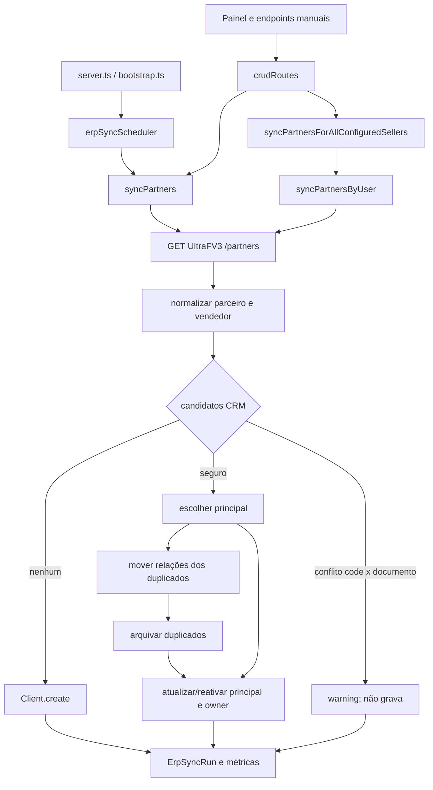

# Investigação ERP 5050 — Fluxo completo ERP → CRM

> **Estado:** engenharia reversa estática do código e histórico Git da branch `work`, em 25/07/2026.  
> **Limite:** não houve acesso ao ERP nem ao banco de produção. O documento prova o comportamento do código, não o payload ou estado real do cliente 5050.

## 1. Conclusão executiva

1. `persistPartnerPayload`, em `ultraFv3SyncService.ts`, é o ponto central de criação e atualização de parceiros ERP.
2. O matching procura **ERP code**, **CPF/CNPJ normalizado** e, apenas se ambos não encontrarem nada, **nome + cidade + UF normalizados**.
3. A carteira não é N:N: `Client.ownerSellerId` é obrigatório e aponta para um único `User`. Troca de carteira/representante substitui esse FK.
4. O cliente **não é arquivado** por sair da resposta, deixar um vendedor, mudar de representante ou porque o vendedor foi inativado. Não há reconciliação negativa de parceiros.
5. No fluxo ERP online, `isArchived=true` só é definido ao fundir duplicados seguros no principal. O duplicado recebe `archiveReason=MERGED_INTO:<id>`.
6. Todo principal atualizado recebe `isArchived=false` e `archiveReason=null`; portanto, pode ser reativado.
7. A troca esperada atualiza o mesmo cliente, sem cópia nem arquivamento. Relacionamentos permanecem no cliente e seus owners/autores históricos não são reatribuídos em massa.
8. O núcleo vigente de matching e troca nasceu em `8ea344e` (12/06/2026, PR #678). A flag e reativação vigentes nasceram em `554bcd2` (16/06/2026, PR #688), completadas pela auditoria de `ea7a70f` na mesma PR.
9. A recuperação de julho não mudou essa semântica. Alterou dados, leitura histórica e ferramentas de auditoria; PRs #728, #731 e #732 adicionaram regressão/diagnóstico.
10. Se o ERP retorna 5050 válido sob o novo vendedor, o esperado é um único cliente ativo sob esse vendedor. Seu desaparecimento após troca **não é esperado**, mas sem auditoria real não é possível separar payload ausente, credencial/paginação, conflito, fallback, arquivo, recuperação ou filtro.

## 2. Diagrama



## 3. Sequência completa

```mermaid
sequenceDiagram
  participant T as Scheduler/API
  participant S as SyncService
  participant E as UltraFV3
  participant D as Prisma/PostgreSQL
  T->>S: syncPartners() ou syncPartnersByUser()
  S->>D: lock + ErpSyncRun
  S->>E: autenticar + GET /partners
  E-->>S: linhas
  S->>D: cache (modo global)
  loop cada objeto com ERP code
    S->>S: mapear e normalizar
    S->>D: buscar code/documento/identidade fraca
    alt conflito forte
      S->>S: contar ambiguidade; skip
    else candidato seguro
      S->>S: escolher principal
      S->>D: transação: mover relações e arquivar duplicados
      S->>D: update principal, ativo e novo owner
      S->>D: TimelineEvent se owner mudou/reativou
    else nenhum candidato
      S->>D: Client.create
    end
  end
  S->>D: finalizar ErpSyncRun
  S-->>T: contadores e diagnósticos
```

### 3.1 Quem chama

| Origem | Caminho | Regra |
|---|---|---|
| Scheduler | `AUTOMATIC_SYNC_STEPS` → `syncPartners` | Boot por `server.ts`/bootstrap; flags de ambiente e banco; janela 07:00–19:00 America/Sao_Paulo; alvo horário. |
| Run now | `runAutomaticErpSyncNow` | Reutiliza a sequência automática. |
| Manual global | `POST /erp/ultrafv3/sync/partners` → `syncPartners` | diretor/gerente. |
| Clientes de oportunidades | `POST .../partners/opportunity-clients` → `syncPartnersForAllConfiguredSellers` | diretor/gerente/vendedor; percorre vendedores configurados. |
| Por vendedor | all-sellers → `syncPartnersByUser` | Credenciais e lock do vendedor. |
| Investigação | GET/POST `/erp/investigate` ou CLI | Read-only; não persiste parceiro. |

O proxy `GET /erp/ultrafv3/partners` somente devolve a resposta externa: não sincroniza o CRM.

### 3.2 Ordem automática

O scheduler executa conexão, vendedores, parceiros, produtos, tabelas, preços, variações, condições, formas, filiais, operações e status. `salesmen` precede `partners`, mas apenas guarda cache e inativa usuário que tenha data de baixa; não cria usuário nem transfere seus clientes. `partners` depende de usuários CRM existentes.

## 4. Identidade, normalização e seleção

Linha sem ERP code é descartada. Linha válida mapeia code, nomes, documento, cidade, UF, região, tipo PF/PJ, endereço (`segment`), timestamp e campos normalizados.

Busca de candidatos:

1. `Client.code === code`;
2. `cnpjNormalized === documento` (ou CNPJ bruto);
3. somente se 1 e 2 forem vazios, `nameNormalized + cityNormalized + state`.

Nomes com `[ARQUIVADO ERP DUP]` são excluídos para a casca arquivada não competir novamente. Há skip conservador se o mesmo code tiver documento forte diferente ou o mesmo documento tiver code diferente. Isso evita corrupção, mas pode manter 5050 antigo/invisível até revisão.

Prioridade do principal: ativo; maior histórico; owner recebido; `erpUpdatedAt` recente; cadastro mais antigo. Os demais candidatos seguros viram duplicados.

## 5. Criação

`prisma.client.create` ocorre somente quando a linha é objeto com code, não há conflito forte e nenhum candidato existe. Nasce com owner resolvido, `erpUpdatedAt` atual e `isArchived=false` pelo default.

- **Sync global:** encontra usuário ativo por `User.erpCode` igual ao vendedor do payload. Se falhar, escolhe o **primeiro vendedor ativo** — risco crítico.
- **Sync por vendedor:** atribui ao vendedor autenticado.

## 6. Atualização

O principal é atualizado em transação. Code, nomes, região, tipo, owner e timestamp são substituídos; documento só quando preenchido; cidade/UF e `segment` preservam o anterior se ausentes. A atualização sempre força `isArchived=false` e limpa `archiveReason`.

Perfis financeiros e títulos são atualizados posteriormente por code e apenas em clientes ativos. Ausência de linha não limpa dados.

## 7. Arquivamento e reativação

### 7.1 Sync ERP online

Somente `mergeDuplicateClientsIntoPrimary` grava `isArchived=true`. Antes, move oportunidades, atividades, timeline, contatos e agenda ao principal. Depois o duplicado:

- recebe code `<code>__MERGED__<timestamp>`;
- perde `cnpjNormalized` e tem o CNPJ bruto marcado;
- recebe prefixo `[ARQUIVADO ERP DUP]`;
- recebe `isArchived=true` e `archiveReason=MERGED_INTO:<primaryId>`.

Logo, arquivo significa **duplicado fundido**, não “fora da carteira” nem “ausente do ERP”.

### 7.2 Outros escritores

- merge administrativo: `manual_duplicate_merge` (ou razão informada), prefixo `[ARQUIVADO]`;
- `erpFixLegacyDuplicates`: saneamento offline com `ULTRAFV3_LEGACY_DUPLICATE_CLEANUP`;
- `erpFixArchivedFlag`: corrige flag de nomes já prefixados;
- recuperação: pode criar `[RECUPERADO]` com `INCIDENT_20260718_MISSING_PARENT_RESTORED`; não é decisão do sync online.

Se um arquivado comum for principal, o update o reativa e cria timeline. O prefixo legado é excluído do matching e não reativa automaticamente.

## 8. Exclusão

O sync nunca chama `client.delete` e nunca exclui por ausência. A exclusão física fica no CRUD `DELETE /clients/:id`, que apaga dependências e cliente em transação conforme permissão. É fluxo humano, não ERP → CRM.

A integração é upsert incremental, não espelho autoritativo: removido/omitido no ERP permanece com último owner conhecido.

## 9. Troca de carteira e representante

### 9.1 Fluxo normal

Quando a identidade reaparece para outro vendedor:

1. matching encontra o cliente independentemente do owner;
2. escolhe o principal ativo/com histórico;
3. `ownerSeller.connect` troca `Client.ownerSellerId`;
4. não cria cópia nem arquiva o principal;
5. grava `TimelineEvent` com vendedor anterior/novo;
6. relações, autores e datas permanecem.

O cliente deixa o vendedor antigo quando o FK é atualizado. Não há histórico estruturado de carteira; apenas evento textual.

### 9.2 Fontes concorrentes

- global mapeia vendedor do payload, com fallback arbitrário;
- por vendedor atribui todas as linhas ao dono da credencial.

Se o mesmo parceiro aparece em várias credenciais, o último processamento ganha. All-sellers é sequencial e ordenado por nome, logo a ordem pode afetar o owner. O modelo não representa carteira compartilhada.

### 9.3 Representante inativado

`syncSalesmen` define `User.isActive=false` quando recebe baixa, mas não move/arquiva clientes. Depois, o mapa global só inclui ativos; se o payload ainda aponta ao inativo, cai no fallback, podendo transferir implicitamente ao vendedor errado.

## 10. Histórico: desde quando e em quais PRs

| Data | Commit / PR | Regra relevante |
|---|---|---|
| 29/04/2026 | `f41e57a`, PR #574 | Primeiro sync manual: match simples por code, create/update e fallback. |
| 20/05/2026 | `fa90fcb`, PR #601 | Dedupe e modo por vendedor; então o vínculo preexistente podia ser preservado. |
| 12/06/2026 | `8ea344e`, PR #678 | Núcleo atual: candidatos globais, principal, fusão, relações e troca de owner sem duplicar. **Origem do comportamento atual de carteira.** |
| 14/06/2026 | `a2c3b0e`, PR #680 | All-sellers para clientes de oportunidades; expôs last-writer-wins. |
| 16/06/2026 | `554bcd2`, PR #688 | Colunas/uso de `isArchived/archiveReason`, arquivo do duplicado e reativação. **Origem do arquivo atual.** |
| 16/06/2026 | `ea7a70f`, PR #688 | Timeline de merge, troca e reativação; dedupe seguro. |
| 16/06/2026 | `43c9b20`, PR #689 | Excluiu prefixos legados do matching; scripts/smokes de flags. |
| 17–19/07/2026 | PRs #724–#726 | Recuperação, leitura histórica e reconciliação; sem mudança na persistência. |
| 23/07/2026 | `a671c32`, PR #728 | Smoke de troca de carteira; regra produtiva intacta. |
| 24/07/2026 | `6de7173`, PR #731 | Paginação/diagnóstico all-sellers e investigação read-only; núcleo preservado. |
| 24/07/2026 | `10cfa52`, PR #732 | Auditoria do 5050 e dry-run de reparo. |
| 24/07/2026 | PRs #733–#734 | Runbook/backup para auditoria no banco recuperado. |

Não há um único commit para todas as facetas: `8ea344e` introduziu matching/troca; `554bcd2`, a flag; `ea7a70f`, a auditoria vigente.

## 11. Antes e depois da recuperação

### Regra igual

Antes da recuperação de 17–19/07 e no HEAD, a decisão essencial permanece a de junho: match global, update de owner, merge de duplicados e reativação. Scripts de recuperação não são chamados pelo scheduler.

### Contexto diferente

- banco recuperado pode conter pais `[RECUPERADO]`, razão própria e identidades incompletas;
- arquivados ganharam leitura histórica controlada, mas seguem fora da listagem/escrita comum;
- ferramentas novas distinguem code, owner, arquivo, duplicado e prefixo;
- configuração, credenciais, scheduler, imagem e cache podem divergir do pré-incidente.

“Funcionava antes e sumiu depois” não prova regressão algorítmica; é compatível com dados, vínculo, flags, configuração ou cobertura alterados.

## 12. ERP 5050: esperado ou bug?

Se 5050 vier de `/partners`, normalizar sem conflito e indicar o novo vendedor, deve localizar `code=5050`, reativar se necessário, trocar o owner e aparecer na lista ativa dele, sem segundo 5050 ativo.

Seu desaparecimento numa troca **não é comportamento funcional esperado**. Pode ser:

- defensivo esperado: conflito causa skip, ERP não retorna, credencial não cobre, arquivo é duplicado legítimo;
- falha operacional/dados: scheduler, deploy, recuperação, owner, code ou paginação;
- bug de desenho: fallback, last-writer-wins, owner único, prefixo como controle, ausência de reconciliação explícita.

Conclusão responsável: **o resultado não é esperado, mas a causa não está provada**.

### Árvore de investigação operacional

1. `npm run erp:investigate-partner -- --erp-code=5050`: provar vendedor/página/campo retornado.
2. `npm run crm:audit-erp-client -- --erp-code=5050`: provar ativo/arquivado, owner, duplicados e filtro.
3. Correlacionar último `ErpSyncRun` de `partners` e logs.
4. `NOT_RETURNED_BY_ERP`: corrigir cobertura/ERP, não reparar CRM às cegas.
5. Conflito: revisar code/documento manualmente.
6. Único ativo com owner errado e payload correto: reproduzir sync controlado antes de reparo.
7. Não usar `--apply` sem evidências preservadas e aprovação do dry-run.

## 13. Riscos

| Risco | Efeito | Severidade | Mitigação |
|---|---|---:|---|
| Primeiro vendedor ativo como fallback | carteira errada/instável | Alta | rejeitar/quarentenar código não mapeado. |
| Last-writer-wins | cliente oscila | Alta | detectar retorno por múltiplas credenciais e definir autoridade. |
| Owner único | não representa compartilhamento | Alta | associação ClientSeller com vigência. |
| Ausência não reconcilia | carteira obsoleta | Média | snapshot explícito, grace period e auditoria. |
| Prefixo exclui matching | correto preso arquivado | Média | FK/estado de merge, não nome. |
| Conflito só gera log | invisibilidade sem fila | Média | entidade/fila de conflitos e alerta. |
| Owners históricos divergem | relatórios inconsistentes | Média | separar owner atual de autor/histórico. |
| Inativação sem migração | clientes sem gestão/fallback | Alta | workflow aprovado de transferência. |
| Delete físico no CRUD | perda irreversível | Alta | soft delete governado. |
| Timeline textual | auditoria fraca | Média | `ClientOwnerChange` estruturado. |
| Recuperado sem identidade | duplicação/match fraco | Alta | reconciliar code/documento antes do sync mutável. |

## 14. Invariantes recomendados

1. Troca de vendedor nunca deve arquivar ou duplicar.
2. Ausência em resposta parcial nunca equivale a exclusão.
3. `isArchived=true` exige razão estruturada e auditoria.
4. Um ERP code deve ter um principal ativo, salvo conflito quarantinado.
5. Relações históricas não são apagadas em merge/troca.
6. Fallback não decide carteira silenciosamente.
7. Recuperação e sync online permanecem separados e idempotentes.

## 15. Fontes internas examinadas

- `apps/api/src/services/ultraFv3SyncService.ts`;
- `apps/api/src/jobs/erpSyncScheduler.ts`;
- `apps/api/src/routes/crudRoutes.ts`;
- `apps/api/src/server.ts` e `apps/api/src/scripts/bootstrap.ts`;
- `apps/api/prisma/schema.prisma` e migração `20260616120000_ultrafv3_financial_titles_archived`;
- `erpPartnerInvestigationService.ts`, `erpClientAuditService.ts`, `erpFixLegacyDuplicates.ts` e `erpFixArchivedFlag.ts`;
- histórico Git e merges PR #574, #601, #678, #680, #688, #689, #724–#726, #728 e #731–#734.
