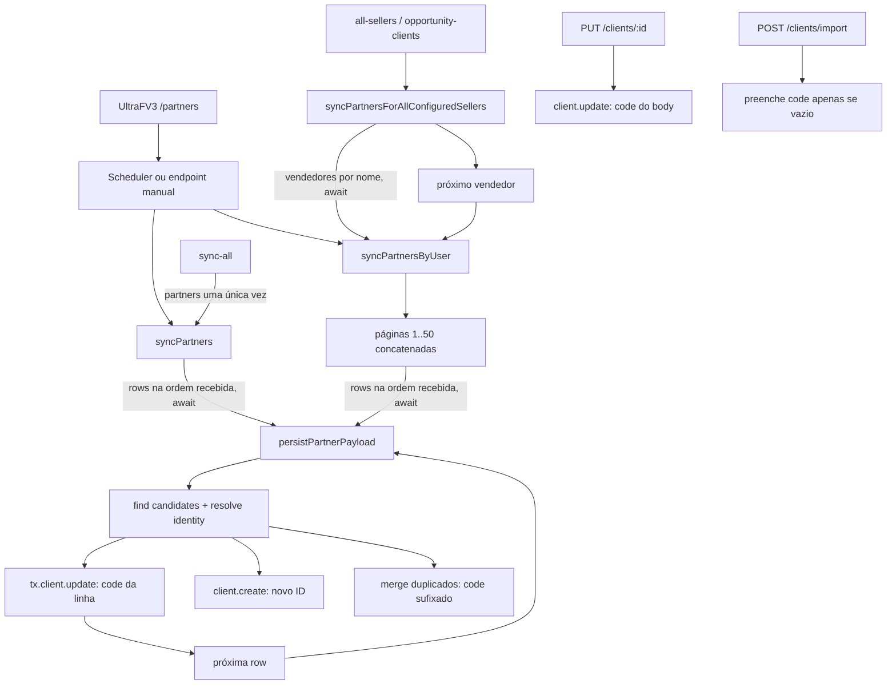
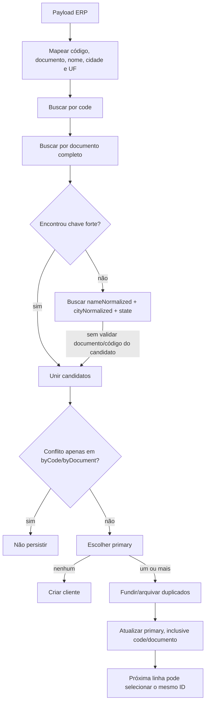
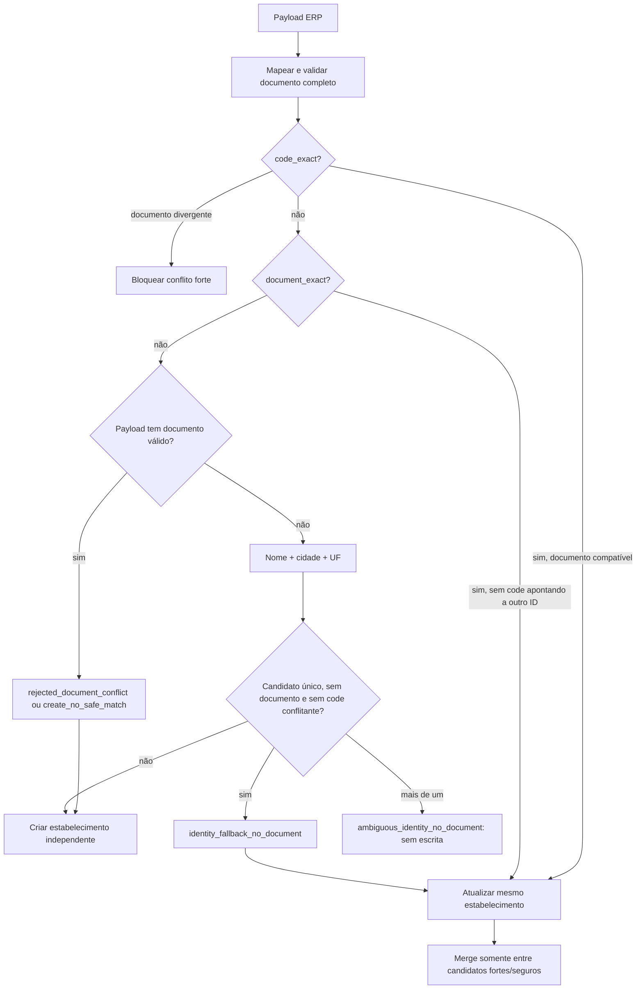

# Incidente de identidade de filiais UltraFV3 — parceiros 5050 e 4484

**Data da investigação:** 30/07/2026  
**Escopo:** código no HEAD local e evidências de produção fornecidas; nenhuma conexão ou escrita em produção  
**Ambiente relatado:** API `gest-o-api-recovery-20260718`; PostgreSQL `gest-o-db-clean-v2-20260717`

## Resumo e causa raiz

O matching anterior consultava `Client.code`, o CPF/CNPJ completo normalizado e, quando nenhum deles retornava resultado, fazia fallback incondicional por `nameNormalized + cityNormalized + state`. Ele não verificava o documento nem o código dos candidatos retornados por esse fallback. Assim, o parceiro 5050 encontrou o cliente 4484 porque ambos normalizavam para a mesma razão social, MARINGA e PR. `choosePrimaryPartnerClient()` escolheu o único candidato e `persistPartnerPayload()` atualizou nesse mesmo `id` o código, documento, fantasia, carteira e demais campos.

| Dado | Parceiro recebido | Cliente escolhido indevidamente |
|---|---|---|
| código ERP | 5050 | 4484 |
| razão social | COCAMAR COOPERATIVA AGROINDUSTRIAL | COCAMAR COOPERATIVA AGROINDUSTRIAL |
| fantasia | COCAMAR CD | COCAMAR SEDE |
| CNPJ | 79.114.450/0033-** | 79.114.450/0040-** |
| cidade/UF | MARINGA/PR | MARINGA/PR |

Os CNPJs completos normalizados são distintos, embora pertençam à mesma raiz empresarial. O algoritmo usa 11 ou 14 dígitos completos e a correção não introduz comparação por raiz.

## Evidências observadas

Os logs fornecidos registraram `PAYLOAD_RECEIVED`, `MAPPED_DATA`, `CANDIDATES` com `candidateCount=1`, `byCodeCount=0`, nenhuma ambiguidade, e `UPDATE_SUCCESS` para `clientId=cmrt98trt02qc3bmt960oosz9`. O estado final relatado manteve apenas `code=4484`, sem código 5050 nem o documento da filial 5050, mas com `financialProfile.PARCEIRO_OUT=5050` no cliente 4484.

O repositório não contém o payload/cache ou os logs integrais dessa execução. Portanto, não é possível demonstrar documentalmente em qual posição ou lote o parceiro 4484 apareceu. O mecanismo de sobrescrita posterior, porém, é explícito: cada linha é processada sequencialmente e todo match atualiza `Client.code`; no modo todos-vendedores, os vendedores também são percorridos sequencialmente por nome. Se uma linha 4484 foi recebida depois da 5050, o mesmo fallback podia selecionar novamente o mesmo `id` já modificado e restaurar código/documento de 4484. Esse caminho explica conjuntamente `UPDATE_SUCCESS` de 5050 e o estado final 4484; confirmar o lote concreto exige preservar os `rows`/logs da execução.

O perfil financeiro é uma etapa posterior do full sync e associa dados exclusivamente ao `Client.code` ativo naquele instante. Ele não limpa automaticamente um perfil anterior quando o código muda. Logo, `financialProfile.PARCEIRO_OUT=5050` prova que aquele `id` teve código 5050 quando alguma execução financeira o alcançou; o estado final 4484 exige uma atualização de parceiro posterior àquela escrita (em outra execução, ou em um fluxo de parceiros disparado depois), e não pode ser produzido apenas pelas etapas restantes do mesmo `FULL_SYNC_STEPS`, que não voltam a executar `partners`. A ordem exata entre execuções só pode ser fechada com `ErpSyncRun` e logs integrais.

## Mapa exato do fluxo

1. `pickUltraFv3PartnerCode()` extrai e normaliza o código, removendo zeros à esquerda.
2. `buildPartnerMappedData()` extrai razão social, fantasia, documento, cidade, UF, região e vendedor; `normalizeDocument()` só aceita CPF/CNPJ completos de 11/14 dígitos não repetidos; `normalizeText()` forma nome/cidade normalizados e `normalizeState()` forma UF.
3. `findPartnerClientCandidates()` consulta primeiro todos os registros por código e documento. Somente sem match forte consulta a identidade normalizada por nome+cidade+UF.
4. Antes da correção, os três conjuntos eram simplesmente unidos. `getPartnerAmbiguityReasons()` analisava conflitos apenas nos conjuntos `byCode` e `byDocument`, nunca em `byIdentity`.
5. `choosePrimaryPartnerClient()` preferia ativo, maior histórico, mesma carteira, atualização ERP mais recente e criação mais antiga.
6. Com candidato, `persistPartnerPayload()` chamava `mergeDuplicateClientsIntoPrimary()` para os demais e depois atualizava código, documento e todos os dados do primário, além de reativá-lo. Sem candidato, criava cliente.
7. O merge move oportunidades, atividades, timeline, contatos e agenda ao primário; neutraliza código/documento e arquiva duplicados como `MERGED_INTO:<id>`.
8. `persistPartnerRowsForSeller()` e `syncPartners()` processam `rows` em ordem com `await`; `syncPartnersForAllConfiguredSellers()` processa vendedores em ordem alfabética, também com `await`. Uma linha posterior podia voltar a escrever o mesmo `Client.id`.
9. No full sync, `partners` precede `financialProfiles` e `partnerTitles`; essas etapas enriquecem o cliente depois do matching de parceiros.

## Regra permanente implementada

A função pura `resolvePartnerIdentityMatch()` centraliza a decisão e retorna uma estratégia estruturada:

- `code_exact`: código exato, desde que não haja documento completo divergente;
- `document_exact`: documento completo exato, evitando duplicação mesmo se o código recebido mudou;
- `identity_fallback_no_document`: nome+cidade+UF somente para um candidato único, também sem documento válido e sem código ERP conflitante;
- `rejected_document_conflict`: identidade fraca colidiu com documento completo diferente; o candidato é rejeitado e um novo cliente é criado;
- `create_no_safe_match`: nenhum match seguro; cria cliente;
- `ambiguous_identity_no_document`: mais de um candidato elegível sem documento; não atualiza nem faz merge automaticamente.

Documentos completos divergentes nunca entram na seleção nem no merge. O log informa presença de documento, estratégia, IDs internos e contagens, sem registrar CPF/CNPJ completo. O log de merge preexistente também deixou de registrar `cnpjNormalized`.

Um conflito entre um código ERP exato já existente e outro documento permanece bloqueado como ambiguidade, em vez de sobrescrever ou tentar criar um segundo registro com o mesmo código. Essa contenção evita violação de unicidade e exige saneamento humano.

## Regressão e cobertura

`ultraFv3PartnerIdentityMatchingSmoke.ts` cobre:

- **A:** 5050 e 4484, mesma identidade fraca e CNPJs de filiais distintos: rejeita 4484 e cria 5050;
- **B:** código diferente e documento exato: `document_exact`, sem duplicação;
- **C:** ambos sem documento e candidato único sem conflito de código: fallback permitido;
- **D:** dois candidatos sem documento: ambiguidade e nenhum merge;
- **E:** documentos e fantasias diferentes: nunca une por razão social/localidade;
- **F:** 5050 já existente por código/documento: update normal;
- **G:** matriz/filiais com documentos completos distintos: clientes independentes;
- **H:** processamento posterior de 4484 resolve somente o cliente 4484 e não troca o código de 5050.

## Riscos residuais e validação pós-deploy

- Bases já corrompidas não são reparadas automaticamente por esta mudança; exigem auditoria e plano de correção separado, sempre com dry-run e backup validado.
- Documento inválido é tratado como ausente. O fallback ainda depende da qualidade de nome/cidade/UF e só é aceito quando único, sem documento e sem conflito de código.
- Código exato associado a documento divergente bloqueia a linha; monitorar `rejected_document_conflict`/ambiguidade e sanear manualmente.
- Sem os `rows` históricos não se comprova a posição exata de 4484 no incidente passado.

Após deploy: confirmar a revisão; executar primeiro em homologação os cenários A–H; iniciar uma sincronização controlada; monitorar estratégias e conflitos sem PII; verificar que 4484 preserva código/CNPJ mascarado e que 5050 é criado com ID próprio; conferir `financialProfile.PARCEIRO_OUT` em cada estabelecimento; comparar contagens de create/update/merge; não executar saneamento destrutivo como parte da validação.

## Arquivos técnicos

- `apps/api/src/services/partnerIdentityMatching.ts`: resolução pura e estratégias.
- `apps/api/src/services/ultraFv3SyncService.ts`: mapeamento, consultas, seleção, persistência, merge e ordenação.
- `apps/api/src/scripts/ultraFv3PartnerIdentityMatchingSmoke.ts`: casos A–H.
- `apps/api/src/scripts/erpPartnerDedupRulesSmoke.ts`: smoke legado do fluxo de deduplicação.
- `docs/DOCUMENTO_MESTRE.md`: registro permanente resumido.

## Auditoria final de encerramento — escritores de `Client.code`

A busca exaustiva no código rastreado incluiu `client.update`, `updateMany`, `upsert`, `create`, `createMany`, transações, SQL raw, migrations, scripts, seeds e rotas administrativas. Não existem `client.upsert`, `client.createMany`, trigger de banco ou SQL raw que atualizem `Client.code`. A migration de unificação cria clientes sem `code`; a migration do campo apenas cria coluna/índice. O schema não declara `code` como `@unique`.

### Escritores efetivos

| Escritor | Condição e entrada | Chamadores/fluxo | Efeito em `code` existente |
|---|---|---|---|
| `POST /clients` → `prisma.client.create({data: payload})` | usuário autenticado envia `clientSchema`, que admite `code` | UI/API administrativa | cria ID novo; não reescreve ID existente |
| `POST /clients/import` → `resolveImportCreateData()` → `client.create()` | linha sem match forte | importação administrativa | cria ID novo com código opcional |
| `POST /clients/import` → `resolveImportUpdateData()` → `client.update()` | match por CNPJ/código e cliente existente está sem código | importação administrativa | preenche somente `code` vazio; não troca `5050` por `4484` |
| `PUT /clients/:id` → `client.update()` | usuário autorizado envia `code` no `clientSchema.partial()` e passa deduplicação | edição administrativa de cliente | pode trocar diretamente qualquer código não conflitante, inclusive `5050` por `4484` |
| `persistPartnerPayload()` → `tx.client.update()` | candidato seguro escolhido para uma linha `/partners` | sync global, individual, todos-vendedores, scheduler ou full sync | grava sempre o código da linha ERP no mesmo ID |
| `persistPartnerPayload()` → `client.create()` | nenhum candidato seguro | mesmos fluxos UltraFV3 | cria ID novo com código ERP |
| `mergeDuplicateClientsIntoPrimary()` → `tx.client.update()` | mais de um candidato seguro | dentro de `persistPartnerPayload()` | muda somente duplicado para `<code>__MERGED__<timestamp>` |
| `POST /clients/diagnostics/merge-duplicates` → `tx.client.update()` | diretor/gerente solicita merge manual | rotina administrativa explícita | muda somente duplicado para `<code>__MERGED__<timestamp>` |
| `erpFixLegacyDuplicates` → `tx.client.update()` | CLI sem `--dry-run`, grupo sem conflito forte | comando `erp:fix-duplicates` | muda somente duplicado para `<code>__LEGACY_DUP__<timestamp>` |

### Operações Prisma que não escrevem `code`

Os seeds padrão, preview e fixture e o smoke bootstrap criam clientes sem código; o smoke atualiza apenas dados cadastrais. O importador de oportunidades pode criar cliente sem código. `backfillClientNormalized` atualiza somente campos normalizados. `erpFixArchivedFlag` e os outros updates do saneamento alteram somente archive. `syncFinancialProfiles` e `syncPartnerTitles` usam `code` no `where`, mas atualizam apenas JSON/totais/datas. A rota legada de companies cria sem código e seu update não inclui código. Portanto essas ocorrências não explicam `5050 → 4484` no mesmo ID.

## Grafo de chamadas e ordem comprovada

As linhas não são ordenadas pelo CRM: `syncPartners()` preserva a ordem de `toArray(response)` e `syncPartnersByUser()` concatena as páginas e preserva a ordem em cada página. `persistPartnerRowsForSeller()` e o loop global usam `for...of` com `await`. Em todos-vendedores, usuários são ordenados por nome e processados em `for...of` com `await`. Portanto, no algoritmo original, se 4484 viesse em posição ou vendedor posterior a 5050, ambos podiam resolver para o mesmo ID pela identidade textual e a segunda chamada a `persistPartnerPayload()` gravava definitivamente `code=4484`.

O retry ocorre somente na leitura HTTP antes da persistência; ele não repete uma linha já persistida. Locks impedem repetição concorrente do mesmo escopo, mas `syncPartnersByUser()` usa lock por vendedor e fluxos administrativos de cliente não compartilham esse lock. Cache de parceiros apenas faz upsert em `AppConfig` e não dispara reprocessamento de clientes.

O full sync contém `partners` exatamente uma vez. Depois dele vêm `financialProfiles` e `partnerTitles`, que não alteram `code`; nenhuma etapa posterior volta a `partners`. Assim, dentro de uma execução de full sync, o mesmo ID podia ser reescrito por outra linha durante a própria etapa `partners`, mas não depois que essa etapa terminava.

## Prova definitiva da cronologia 5050 → 4484

**Resposta: SIM, existe caminho de código capaz de reescrever `Client.code` depois do update de 5050.** Há dois escritores que podem produzir exatamente o valor final não sufixado `4484` em um ID existente:

1. outra chamada a `persistPartnerPayload()` para a linha ERP 4484, posterior no mesmo array/lote, em vendedor posterior no all-sellers, ou em nova execução de partner sync;
2. `PUT /clients/:id` com `code=4484` por edição administrativa autorizada.

Importação não troca código preenchido; merges e saneamento geram códigos sufixados; creates não alteram o mesmo ID; demais updates não incluem `code`. Logo, esses caminhos estão excluídos para o valor final exato `4484`.

O dado `financialProfile.PARCEIRO_OUT=5050` estreita ainda mais a cronologia: `syncFinancialProfiles()` só encontra cliente ativo por `where: {code: "5050"}`. Portanto o ID estava com `code=5050` durante a escrita financeira, e uma das duas operações acima escreveu `4484` **depois** dela. Como `financialProfiles` ocorre depois de `partners` e o full sync não repete `partners`, essa transição final não pode ter sido uma segunda linha da etapa partners do mesmo full sync que gravou o perfil; ela pertence necessariamente a um partner sync posterior ou a um `PUT /clients/:id` posterior. Isso é consequência necessária da ordem e dos campos gravados, não hipótese.

O código não contém audit trail de alteração de `Client.code` na rota PUT e os logs históricos integrais não estão no repositório; por isso o código, isoladamente, não distingue qual dos dois escritores executou em produção. A mecânica, os únicos escritores compatíveis e a ordem necessária estão encerrados.

## Diagramas do algoritmo

### Algoritmo original

### Algoritmo novo

## Revisão crítica final da correção

A resolução nova não permite unir filiais com documentos completos diferentes: payload documentado nunca recebe candidato de identidade, e código exato com documento diferente é bloqueado. Um candidato com documento válido também é excluído do fallback quando o payload não tem documento. O código exato sem documento pode receber o documento válido do mesmo código, preservando enriquecimento legítimo. Documento exato pode atualizar código, preservando mudança legítima; se o novo código já aponta a outro ID, a ambiguidade cruzada bloqueia a escrita. Múltiplos candidatos sem documento não são mesclados.

Os falsos negativos deliberados são: payload com documento válido não é reconciliado por texto a candidato sem documento; e código exato/documento conflitante exige saneamento humano. Ambos implementam a regra permanente e evitam dano maior. O risco residual funcional é a edição administrativa PUT, que continua podendo trocar um código de forma intencional e não possui auditoria específica do valor anterior; isso não invalida a proteção do sync, mas deve ser considerado em investigação operacional futura.

**Conclusão forense A:** foram encontrados pontos reais que reescrevem `Client.code`. O caminho original de partners permitia reescrita sequencial do mesmo ID, e a rota administrativa PUT também permite troca direta. A combinação estado financeiro 5050 + estado final 4484 prova uma escrita posterior ao financial sync e exclui as etapas posteriores do mesmo full sync. A investigação do mecanismo está tecnicamente encerrada.
